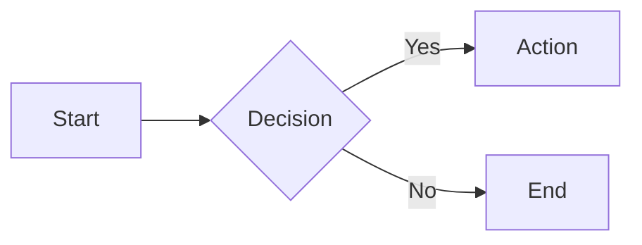

# Markdown Syntax Reference

## Headings

```markdown
# Heading 1
## Heading 2
### Heading 3
#### Heading 4
##### Heading 5
###### Heading 6
```

## Text Formatting

```markdown
**bold**
*italic*
~~strikethrough~~
`inline code`
> blockquote
```

## Links & Images

```markdown
[Link text](https://example.com)
[Link with title](https://example.com "Title")

```

## Lists

```markdown
- Unordered item
- Another item
  - Nested item

1. Ordered item
2. Second item
   1. Nested ordered

- [x] Task complete
- [ ] Task incomplete
```

## Code Blocks

````markdown
```javascript
const greeting = "Hello, World!";
console.log(greeting);
```

```csharp
var message = "Hello, World!";
Console.WriteLine(message);
```
````

## Tables

```markdown
| Column 1 | Column 2 | Column 3 |
|----------|----------|----------|
| Row 1    | Data     | Data     |
| Row 2    | Data     | Data     |

| Left | Center | Right |
|:-----|:------:|------:|
| L    |   C    |     R |
```

## Horizontal Rule

```markdown
---
```

## Blockquotes

```markdown
> Single line quote

> Multi-line quote
> continues here
>
> > Nested quote
```

## Footnotes

```markdown
Here is a statement[^1].

[^1]: This is the footnote content.
```

## Definition Lists

```markdown
Term
: Definition of the term
```

## Collapsed Section (GitHub)

```markdown
<details>
<summary>Click to expand</summary>

Hidden content here.

</details>
```

## Alerts (GitHub)

```markdown
> [!NOTE]
> Useful information.

> [!TIP]
> Helpful advice.

> [!WARNING]
> Potential issues.

> [!CAUTION]
> Dangerous actions.
```

## Escaping Characters

```markdown
\* not italic \*
\# not a heading
\[not a link\]
```

## Math (GitHub / MathJax)

```markdown
Inline: $E = mc^2$

Block:
$$
\sum_{i=1}^{n} x_i = x_1 + x_2 + \cdots + x_n
$$
```

## Mermaid Diagrams (GitHub)

````markdown

````
