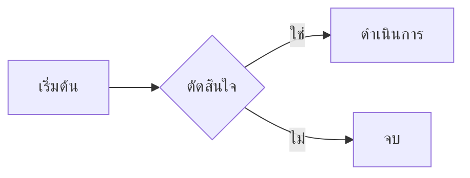

# คู่มือ Syntax ของ Markdown

## หัวข้อ (Headings)

```markdown
# หัวข้อระดับ 1
## หัวข้อระดับ 2
### หัวข้อระดับ 3
#### หัวข้อระดับ 4
##### หัวข้อระดับ 5
###### หัวข้อระดับ 6
```

## การจัดรูปแบบข้อความ

```markdown
**ตัวหนา**
*ตัวเอียง*
~~ขีดฆ่า~~
`โค้ดในบรรทัด`
> ข้อความอ้างอิง
```

## ลิงก์และรูปภาพ

```markdown
[ข้อความลิงก์](https://example.com)
[ลิงก์พร้อมชื่อ](https://example.com "ชื่อ")

```

## รายการ (Lists)

```markdown
- รายการแบบไม่เรียงลำดับ
- อีกรายการ
  - รายการย่อย

1. รายการแบบเรียงลำดับ
2. รายการที่สอง
   1. รายการย่อย

- [x] งานเสร็จแล้ว
- [ ] งานยังไม่เสร็จ
```

## บล็อกโค้ด

````markdown
```javascript
const greeting = "สวัสดีชาวโลก";
console.log(greeting);
```

```csharp
var message = "สวัสดีชาวโลก";
Console.WriteLine(message);
```
````

## ตาราง

```markdown
| คอลัมน์ 1 | คอลัมน์ 2 | คอลัมน์ 3 |
|-----------|-----------|-----------|
| แถว 1     | ข้อมูล    | ข้อมูล    |
| แถว 2     | ข้อมูล    | ข้อมูล    |

| ชิดซ้าย | กึ่งกลาง | ชิดขวา |
|:--------|:--------:|-------:|
| ซ้าย    |  กลาง   |   ขวา |
```

## เส้นคั่น

```markdown
---
```

## ข้อความอ้างอิง (Blockquotes)

```markdown
> อ้างอิงบรรทัดเดียว

> อ้างอิงหลายบรรทัด
> ต่อเนื่องที่นี่
>
> > อ้างอิงซ้อน
```

## เชิงอรรถ (Footnotes)

```markdown
นี่คือข้อความ[^1]

[^1]: นี่คือเนื้อหาเชิงอรรถ
```

## ส่วนที่ซ่อนได้ (GitHub)

```markdown
<details>
<summary>คลิกเพื่อขยาย</summary>

เนื้อหาที่ซ่อนอยู่

</details>
```

## การแจ้งเตือน (GitHub Alerts)

```markdown
> [!NOTE]
> ข้อมูลที่เป็นประโยชน์

> [!TIP]
> คำแนะนำที่ช่วยได้

> [!WARNING]
> ปัญหาที่อาจเกิดขึ้น

> [!CAUTION]
> การกระทำที่อันตราย
```

## การ Escape ตัวอักษร

```markdown
\* ไม่ใช่ตัวเอียง \*
\# ไม่ใช่หัวข้อ
\[ไม่ใช่ลิงก์\]
```

## สูตรคณิตศาสตร์ (GitHub / MathJax)

```markdown
ในบรรทัด: $E = mc^2$

แบบบล็อก:
$$
\sum_{i=1}^{n} x_i = x_1 + x_2 + \cdots + x_n
$$
```

## แผนภาพ Mermaid (GitHub)

````markdown

````
